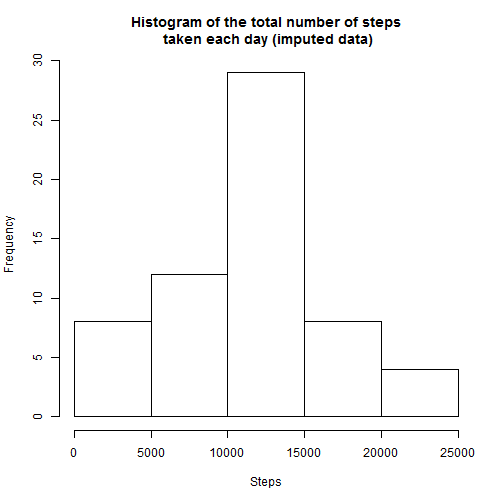

# Reproducible Research: Peer Assessment 1


## Loading and preprocessing the data
Load the data in R as data frame. Specify the required classes in read.csv to make reading and formatting a single step.

```r
data <- read.csv("activity.csv", header=TRUE, colClasses=c("integer", "Date", "integer"))
str(data)
```

```
## 'data.frame':	17568 obs. of  3 variables:
##  $ steps   : int  NA NA NA NA NA NA NA NA NA NA ...
##  $ date    : Date, format: "2012-10-01" "2012-10-01" ...
##  $ interval: int  0 5 10 15 20 25 30 35 40 45 ...
```


## What is mean total number of steps taken per day?
For this part, we need to calculate the total daily steps.

```r
dailySteps <- with(data, aggregate(steps, by=list(date), FUN=sum))
names(dailySteps) <- c("date", "steps")
summary(dailySteps)
```

```
##       date                steps      
##  Min.   :2012-10-01   Min.   :   41  
##  1st Qu.:2012-10-16   1st Qu.: 8841  
##  Median :2012-10-31   Median :10765  
##  Mean   :2012-10-31   Mean   :10766  
##  3rd Qu.:2012-11-15   3rd Qu.:13294  
##  Max.   :2012-11-30   Max.   :21194  
##                       NA's   :8
```
1) Make a histogram of the total number of steps taken each day.

```r
hist(dailySteps$steps, main = "Histogram of the total
     number of steps taken each day", xlab="Steps")
```

 

2) Calculate and report the mean and median total number of steps taken per day.

```r
mean(dailySteps$steps, na.rm=TRUE)
```

```
## [1] 10766
```

```r
median(dailySteps$steps, na.rm=TRUE)
```

```
## [1] 10765
```


## What is the average daily activity pattern?
Calculate the avereage steps in each interval.

```r
avgSteps <- with(data[!is.na(data$steps),], aggregate(steps, by=list(interval), FUN=mean))
names(avgSteps) <- c("interval", "avsteps")
summary(avgSteps)
```

```
##     interval       avsteps      
##  Min.   :   0   Min.   :  0.00  
##  1st Qu.: 589   1st Qu.:  2.49  
##  Median :1178   Median : 34.11  
##  Mean   :1178   Mean   : 37.38  
##  3rd Qu.:1766   3rd Qu.: 52.83  
##  Max.   :2355   Max.   :206.17
```
1) Make a time series plot of the 5-minute interval (x-axis) and the average number of steps taken, averaged across all days (y-axis).

```r
library(ggplot2)
myplot <- ggplot(avgSteps, aes(x=interval, y=avsteps))
myplot <- myplot + geom_line()
myplot <- myplot + labs(x="5-minute interval", y = "Average number of steps", title = "Number of steps taken in 5-minute intervals, averaged across all days")
myplot
```

 

2) Determine which 5-minute interval contains the maximum number of steps.

```r
maxStepIndex <- which.max(avgSteps$avsteps)
avgSteps$avsteps[maxStepIndex]
```

```
## [1] 206.2
```

```r
avgSteps$interval[maxStepIndex]
```

```
## [1] 835
```


## Imputing missing values
There are a number of days/intervals where there are missing values. The presence of missing days may introduce bias into some calculations or summaries of the data.

1) Calculate and report the total number of missing values in the dataset (i.e. the total number of rows with NAs)

```r
missingCount <- sum(is.na(data$steps))
missingCount
```

```
## [1] 2304
```
2) Devise a strategy for filling in all of the missing values in the dataset.
Let's fill it by the average of that interval.

```r
join <- merge(data, avgSteps, by="interval")
filledData <- data
filledData$steps[is.na(filledData$steps)] <- join$avsteps[is.na(data$steps)]
summary(filledData)
```

```
##      steps            date               interval   
##  Min.   :  0.0   Min.   :2012-10-01   Min.   :   0  
##  1st Qu.:  0.0   1st Qu.:2012-10-16   1st Qu.: 589  
##  Median :  0.0   Median :2012-10-31   Median :1178  
##  Mean   : 37.8   Mean   :2012-10-31   Mean   :1178  
##  3rd Qu.: 29.0   3rd Qu.:2012-11-15   3rd Qu.:1766  
##  Max.   :806.0   Max.   :2012-11-30   Max.   :2355
```

4) Make a histogram of the total number of steps taken each day and Calculate and report the mean and median total number of steps taken per day.

```r
filledStepsAgg <- with(filledData, aggregate(steps, by=list(date), FUN=sum))
names(filledStepsAgg) <- c("date","steps")
hist(filledStepsAgg$steps, main = "Histogram of the total number of steps\n taken each day (imputed data)", 
    xlab = "Steps")
```

 

```r
mean(filledStepsAgg$steps)
```

```
## [1] 10890
```

```r
median(filledStepsAgg$steps)
```

```
## [1] 11015
```
Imputing missing data has made a minor increment in both mean and median.

## Are there differences in activity patterns between weekdays and weekends?
Create a new factor variable in the dataset with two levels - "weekday" and "weekend" indicating whether a given date is a weekday or weekend day.

```r
filledData$dayofweek <- weekdays(filledData$date) 
head(filledData)
```

```
##   steps       date interval dayofweek
## 1 1.717 2012-10-01        0    Monday
## 2 1.717 2012-10-01        5    Monday
## 3 1.717 2012-10-01       10    Monday
## 4 1.717 2012-10-01       15    Monday
## 5 1.717 2012-10-01       20    Monday
## 6 1.717 2012-10-01       25    Monday
```

```r
filledData$dayofweek[filledData$dayofweek == 'Saturday' |
                    filledData$dayofweek == 'Sunday'] <- 'weekend'
filledData$dayofweek[filledData$dayofweek != 'weekend'] <- 'weekday'
filledData$dayofweek <- as.factor(filledData$dayofweek)
head(filledData)
```

```
##   steps       date interval dayofweek
## 1 1.717 2012-10-01        0   weekday
## 2 1.717 2012-10-01        5   weekday
## 3 1.717 2012-10-01       10   weekday
## 4 1.717 2012-10-01       15   weekday
## 5 1.717 2012-10-01       20   weekday
## 6 1.717 2012-10-01       25   weekday
```

```r
str(filledData)
```

```
## 'data.frame':	17568 obs. of  4 variables:
##  $ steps    : num  1.72 1.72 1.72 1.72 1.72 ...
##  $ date     : Date, format: "2012-10-01" "2012-10-01" ...
##  $ interval : int  0 5 10 15 20 25 30 35 40 45 ...
##  $ dayofweek: Factor w/ 2 levels "weekday","weekend": 1 1 1 1 1 1 1 1 1 1 ...
```

Make a panel plot containing a time series plot of the 5-minute interval (x-axis) and the average number of steps taken, averaged across all weekday days or weekend days (y-axis).

```r
finalAgg <- aggregate(filledData$steps, by=list(filledData$interval, filledData$dayofweek), FUN="mean")
names(finalAgg) <- c("interval", "dayofweek", "steps")
summary(finalAgg)
```

```
##     interval      dayofweek       steps       
##  Min.   :   0   weekday:288   Min.   :  4.43  
##  1st Qu.: 589   weekend:288   1st Qu.:  9.69  
##  Median :1178                 Median : 29.38  
##  Mean   :1178                 Mean   : 40.31  
##  3rd Qu.:1766                 3rd Qu.: 60.38  
##  Max.   :2355                 Max.   :207.23
```

```r
library(lattice)
xyplot(steps ~ interval | dayofweek, data=finalAgg,
       type='l',
       lwd=2,
       layout=c(1,2),
      ylab = 'Number of steps')
```

 

During weekdays, there is a peak early in the day. But otherwise, the number of steps on an average remain lower than weekends.
